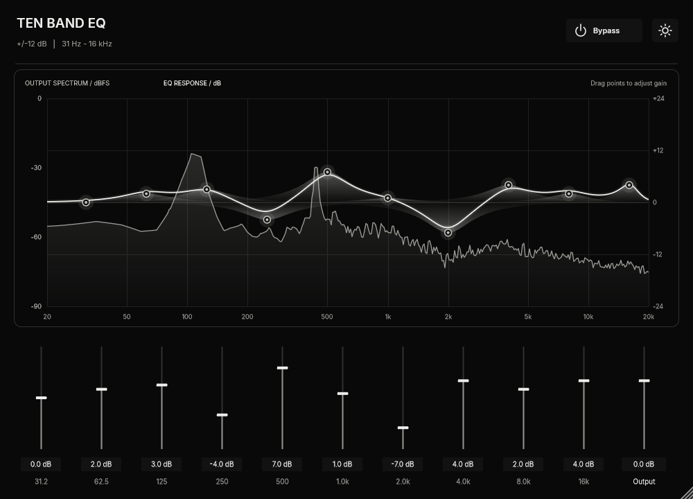
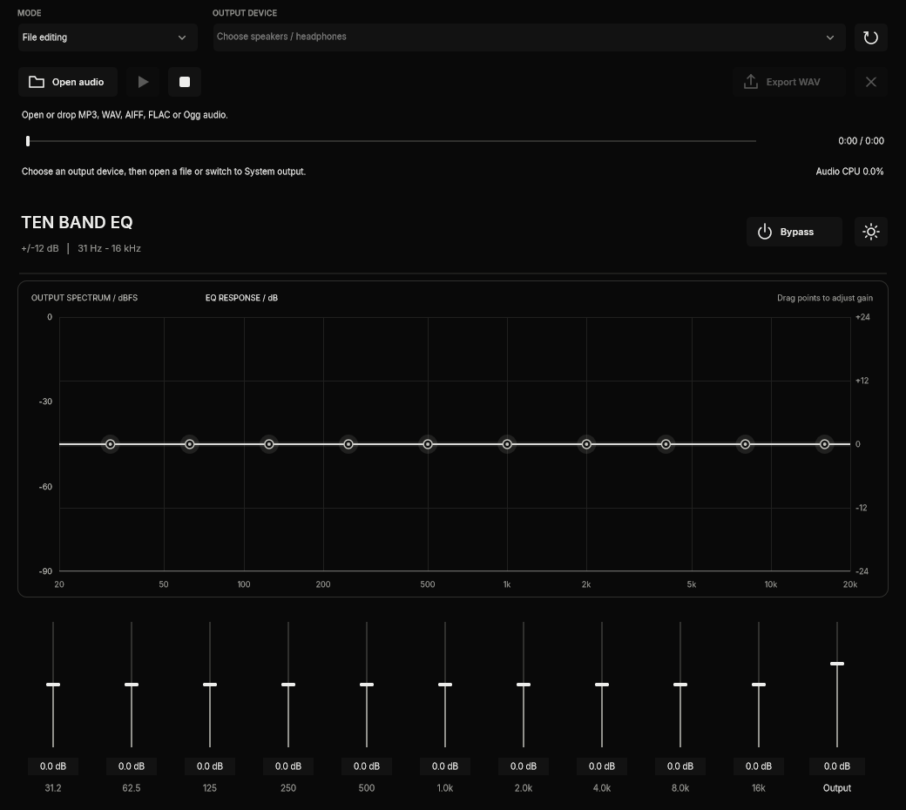
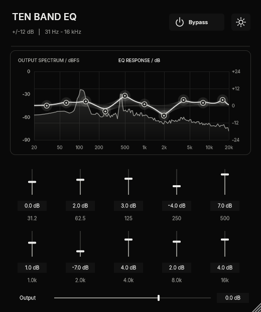
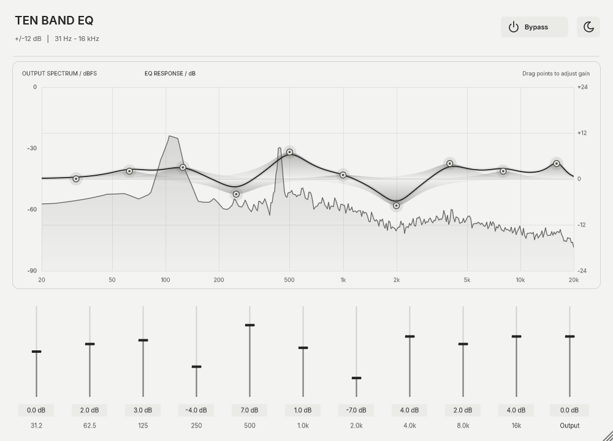

# Ten Band EQ

**A ten-band equalizer for Audacity and a standalone audio application, built with JUCE and C++17.**

Shape mono or stereo audio, watch the live frequency spectrum, process an audio file, or equalize Windows system playback through a separate virtual audio device. The interface uses a flat black, marble-inspired finish with consistent monochrome controls.



**Version:** 0.2.0 · **Formats:** VST3 and standalone · **License:** [AGPL-3.0](LICENSE) · **Verified build:** Windows x64 / Visual Studio 2026

[Features](#features) · [Build](#build) · [Audacity](#use-in-audacity) · [File editing](#edit-an-audio-file) · [System audio](#equalize-windows-system-audio) · [Controls](#controls-and-appearance) · [Development](docs/DEVELOPMENT.md) · [Licensing](#licensing)

## Features

- Ten fixed-frequency peak filters, with gain from -12 to +12 dB per band.
- Output trim from -24 to +12 dB and a bypass control.
- Mono/stereo processing, host automation and saved parameter state.
- Live output spectrum, individual band response fills and a combined response curve.
- Drag graph points to adjust gain; double-click a point to reset it.
- Standalone playback and seeking for MP3, WAV, AIFF, FLAC and Ogg files.
- Background export of equalized audio to 32-bit floating-point WAV.
- Windows WASAPI loopback capture with separate source and output devices.
- Responsive layout, saved dark/light preference, vector icons and tooltips.
- Cached filters and graph curves, smoothed gains and bounded audio queues.

### Audio specifications

| Property | Value |
| --- | --- |
| Band centers | 31.25, 62.5, 125, 250, 500 Hz; 1, 2, 4, 8, 16 kHz |
| Filter type | Ten serial minimum-phase peak biquads |
| Band gain / Q | -12 to +12 dB / fixed Q approximately 1.414 |
| Output gain | -24 to +12 dB |
| Gain smoothing | 15 ms; filter updates in 64-sample chunks while changing |
| Channel layouts | Mono and stereo |
| Sample rate | Follows the host/device; centers are clamped below Nyquist at low rates |
| Analyzer | 4096-sample Hann-window FFT, up to 30 UI updates/second |
| Export | 32-bit float WAV, original sample rate, channel count and duration |
| MIDI / instruments | No MIDI input/output; audio effect only |

There is no limiter or automatic gain compensation. Reduce **Output** when boosting bands to avoid clipping at playback or subsequent processing stages.

## Screenshots

These are renders of the actual application UI. The EQ screenshots use generated test audio and an illustrative EQ curve, not a factory preset. The standalone screenshot shows its idle file-editing view, with no audio device opened. Native window borders are omitted.

### Standalone application



### Compact layout and optional light mode

<table>
<tr>
<td width="38%"></td>
<td width="62%"></td>
</tr>
</table>

## Platform support

| Feature | Windows | macOS / Linux |
| --- | --- | --- |
| VST3 and standalone build | Release x64 build verified | JUCE-based code path; builds unverified |
| Audio file playback / export | Regression checks passed | Unverified |
| System playback capture | Windows WASAPI implementation | Not implemented |
| Native San Francisco font | Uses bundled Inter instead | Native system font on macOS; Inter on Linux |

VST3 is intended for Audacity and other compatible hosts. The latest UI has been checked through standalone and editor renders; a host compatibility matrix has not been established. A complete virtual-device-to-speaker system route still needs manual listening verification. AU, AAX, VST2 and LV2 builds are not configured.

## Build

### Requirements

- CMake **3.22 or newer**.
- Git, for CMake's JUCE download.
- A C++17 compiler. On Windows, install Visual Studio with **Desktop development with C++**, MSVC and a Windows SDK.
- Internet access on the first configure, unless using a local JUCE checkout.

JUCE is pinned to **8.0.15**. Inter fonts are included in `Assets/Fonts`; no font installation, image service or proprietary graphics assets are required. The documented Windows toolchain uses Microsoft's compiler; the UI and design are implemented directly in JUCE.

### Windows: Command Prompt

Download or clone this repository, open `cmd.exe`, and enter its directory. Replace the example path with your own:

```bat
cd /d "C:\path\to\plugin-10band-eq"
cmake -S . -B build-vs18 -G "Visual Studio 18 2026" -A x64
cmake --build build-vs18 --config Release --parallel 4
```

For Visual Studio 2022, use a separate build directory:

```bat
cmake -S . -B build-vs17 -G "Visual Studio 17 2022" -A x64
cmake --build build-vs17 --config Release --parallel 4
```

Re-run the build command after editing source files. CMake automatically reconfigures when `CMakeLists.txt` changes.

To use an existing JUCE checkout instead of downloading it:

```bat
cmake -S . -B build-vs18 -G "Visual Studio 18 2026" -A x64 -DJUCE_DIR="C:/path/to/JUCE"
```

Use a JUCE 8.0.15 checkout for the configuration tested here. Platform-specific development notes are in [Development](docs/DEVELOPMENT.md).

### Build outputs

| Output | Release path |
| --- | --- |
| Standalone executable | `build-vs18/TenBandEQ_artefacts/Release/Standalone/Ten Band EQ.exe` |
| VST3 bundle | `build-vs18/TenBandEQ_artefacts/Release/VST3/Ten Band EQ.vst3/` |
| Optional regression runner | `build-vs18/Release/TenBandEQTests.exe` |

`Inter-LICENSE.txt` is copied beside each binary. Distribute the complete VST3 directory, including its contents. An installer and signed release packages are not supplied.

## Use in Audacity

1. Build the VST3 target and close Audacity before installing or replacing the plugin.
2. Copy the complete **Ten Band EQ.vst3** bundle into a VST3 directory scanned by Audacity. A standard Windows system location is `C:\Program Files\Common Files\VST3`; writing there may require administrator rights.
3. Open Audacity, open its Plugin Manager, rescan if necessary, and enable **Ten Band EQ**.
4. Apply it to audio or add it through Audacity's realtime effects workflow where supported by your version.
5. Match the plugin and host CPU architectures, such as x64 with x64.

See Audacity's [official plugin installation guide](https://support.audacityteam.org/basics/installing-plugins) for version-specific menus. Plugin processing operates on audio supplied by Audacity; Windows system playback is handled by the standalone application.

## Edit an audio file

Launch from the project directory:

```bat
"build-vs18\TenBandEQ_artefacts\Release\Standalone\Ten Band EQ.exe"
```

1. Select **File editing** and choose speakers or headphones under **Output device**.
2. Click the folder / **Open audio** button, or drop one mono/stereo MP3, WAV, AIFF, FLAC or Ogg file into the window.
3. Click **Play** and adjust the bands. The position slider seeks; **Pause** retains position and **Stop** returns to the beginning.
4. Click **Export WAV** to save an equalized copy. The adjacent cross cancels an active export.

Export snapshots the EQ, Output and Bypass settings when it starts. Playback and later adjustments can continue without changing that export. Processing runs in bounded blocks on a worker thread.

The original file is preserved. Exporting to the input path is rejected, and an existing destination is replaced only after a successful export. Cancellation preserves the existing destination. Output retains the original sample rate, channels and duration; tags and artwork are not copied. MP3 encoding, trimming, selection regions and timeline editing are not implemented.

Floating-point WAV retains samples above 0 dBFS; they can still clip when played or converted to an integer format. EQ settings, theme and selected output device are saved on normal app shutdown. Playback does not start automatically at launch, and the last file is not automatically reopened.

## Equalize Windows system audio

```text
Windows / other apps
        |
        v
Virtual playback device --> WASAPI loopback --> Ten Band EQ --> Physical speakers / headphones
```

WASAPI loopback captures the mix sent to a playback endpoint. It does not intercept and replace that endpoint's existing speaker output. Use a separate virtual source to hear only the equalized route. See Microsoft's [loopback documentation](https://learn.microsoft.com/en-us/windows/win32/coreaudio/loopback-recording).

1. Install and configure a compatible virtual playback device separately. An open-source project to evaluate is [Virtual Audio Driver](https://github.com/VirtualDrivers/Virtual-Audio-Driver); review its current installation and signing requirements. No virtual driver is bundled here.
2. Set that virtual device as the Windows default output, or route individual apps to it in Volume mixer. Configure the source as stereo.
3. Select your **physical speakers/headphones** under the standalone's **Output device**.
4. Select **System output (Windows)**, choose the virtual device as the source, and click **Start system EQ**.
5. Adjust the EQ. Click **Stop system EQ** to stop forwarding; restore your physical Windows default output when finished.

Source and output must be different devices. The application rejects capture of its own selected output and rejects ambiguous output endpoint names. Capturing a separate physical device is possible, but it may also play its original unprocessed audio.

Capture supports mono/stereo float32 and PCM16/24/32, with resampling when source and output rates differ. A bounded FIFO and adaptive resampling handle device clock drift. The buffering target is at least **30 ms or two output blocks**, plus OS/device buffering. Actual latency depends on your route. The toolbar reports audio callback CPU and capture dropouts.

Shared-mode playback is required for this route; exclusive playback and protected content may not be capturable. This is not a system driver or a background audio service: the application must remain running.

## Controls and appearance

| Control | Action |
| --- | --- |
| Band slider or numeric value | Adjust that fixed band's gain |
| Graph point | Drag vertically to adjust; double-click to reset to 0 dB |
| Output | Adjust gain after all ten filters |
| Bypass | Disable equalization and output trim; active state has a subtle underline |
| Sun / moon | Switch dark/light mode; saved with EQ state |
| Folder | Open an audio file |
| Play / pause | Start or pause file playback |
| Square | Stop file playback and return to the beginning |
| Export arrow / cross | Export WAV / cancel active export |
| Circular arrow | Refresh audio devices; processing stops before refresh |
| System power button | Start or stop the selected system audio route |

Buttons, selectors, slider readouts and icons share a neutral palette. Controls are flat, with no bevels, drop shadows or raised edges. Hover, focus, disabled and active states remain distinguishable. The black finish is painted directly in code, with no raster texture or texture loading cost.

Below 820 logical pixels, the EQ switches to two rows of five bands and a horizontal Output slider. Standalone device controls stack, and its EQ area scrolls when the window is short. Minimum plugin editor size is 520 x 620.

The standalone opens centered on the monitor under the pointer, at **60% of its usable height** (excluding the taskbar/dock). Width is 1040 logical pixels, capped at 90% of the monitor's usable width. DPI scaling is accounted for. The usual minimum standalone size is 560 x 400, reduced if necessary to fit the initial screen-relative size. Its custom title bar and minimize, maximize/restore and close buttons follow the app's dark/light palette. You can drag the title bar and resize the window; native file dialogs still follow the OS.

macOS uses the native system UI font, San Francisco on supported systems. Windows/Linux use bundled **Inter**. Apple fonts are not redistributed; see Apple's [font guidance](https://developer.apple.com/documentation/technologyoverviews/fonts). Buttons have accessible labels and hover tooltips; keyboard focus is outlined.

### Read the spectrum

The muted spectrum line shows audio **after EQ and output gain**, with frequency on a logarithmic horizontal axis. The left axis measures spectrum level in dBFS; the right measures EQ response in dB. The brighter curve combines all bands and output trim; faint fills show individual bands. The display spans 20 Hz to 20 kHz, limited by sample rate.

This is a frequency spectrum, not a time-domain waveform. Stereo channel power is combined so opposite-polarity channels remain visible. Bypass shows a flat response and the incoming spectrum. After audio stops, the spectrum fades. The analyzer needs one FFT frame (about 93 ms at 44.1 kHz); this visualization delay does not add audio latency. Low-frequency resolution is limited by the FFT size.

## Efficiency

- Unchanged bands reuse coefficients; neutral bands skip filter processing.
- Settled gains avoid repeated trigonometric coefficient calculations.
- The EQ response image is cached until gains, sample rate, size, selection or theme changes.
- Closed/hidden editors stop spectrum capture and FFT work; unchanged displays stop repainting.
- File decoding uses a read-ahead thread; export runs on a separate worker.
- Preallocated buffers and bounded queues keep slow visual rendering from blocking audio.
- Icons and surfaces use vector drawing; the new appearance adds no texture assets or animation timers.

See [benchmark commands and measurement limits](docs/DEVELOPMENT.md#benchmark) for reproducible DSP comparisons.

## Troubleshooting

| Symptom | What to check |
| --- | --- |
| CMake generator does not match the cache | Use `build-vs18` for VS 2026 and `build-vs17` for VS 2022. Do not switch generators within an existing build directory. |
| CMake cannot find Visual Studio | Install the C++ desktop workload and Windows SDK; configure a fresh directory with the version actually installed. |
| Linker cannot replace the executable/plugin | Close the running standalone and hosts loading the plugin, then rebuild. |
| Audacity cannot find the plugin | Copy the entire `.vst3` bundle, check x64 compatibility, rescan and enable it in Plugin Manager. |
| Silent file playback | Select an available output device, load a supported mono/stereo file, press Play and check Output gain. |
| Dry audio and EQ audio play together | Route apps to a virtual source; send only Ten Band EQ to physical speakers. |
| System route is rejected | Choose distinct source/output devices; give duplicate endpoint names unique names in Windows. |
| Dropouts or disconnected device | Stop processing, refresh devices and reselect the source/output route. Check the CPU/dropout readout. |
| Distortion after boosting | Lower Output; there is no automatic limiter or gain compensation. |
| Spectrum is empty | Play audio through this instance. Analysis pauses while the editor is hidden. |
| File will not open | Use a non-empty mono/stereo file in a supported format. Multichannel, DRM-protected and corrupt files are unsupported. |

## Development and verification

```bat
cmake -S . -B build-vs18 -G "Visual Studio 18 2026" -A x64 -DTENBAND_EQ_BUILD_TESTS=ON
cmake --build build-vs18 --config Release --parallel 4
ctest --test-dir build-vs18 -C Release --output-on-failure
```

Tests cover FFT calibration, stereo polarity, silence, queue overflow, filter response, trim/bypass, coefficient reuse, gain smoothing, disabled analysis, WAV export, original preservation and cancellation. UI previews are visually reviewed; they are not automated pixel-comparison tests.

[Development documentation](docs/DEVELOPMENT.md) covers source organization, screenshot regeneration, benchmarks, optional MP3/device checks and release preparation. For bug reports, include OS, host/version, build configuration, sample rate, reproduction steps and the error text. For system routing issues, include source/output device names and channel formats. Avoid attaching private audio unless needed and permitted.

## Limitations and possible additions

Current limitations: fixed centers and Q; mono/stereo only; WAV-only export; Windows-only system capture; no limiter, auto gain, preset browser, spectrum freeze, file selection editing or linear-phase mode. The system route needs an external virtual device and adds buffering latency.

Possible extensions include a peak meter, level-matched bypass, factory presets, adjustable frequency/Q, an input spectrum, selection-based export and a separately designed linear-phase mode. These are ideas, not shipped features.

## Licensing

Ten Band EQ's original source code, documentation and UI assets are licensed under the **GNU Affero General Public License, version 3.0** (`AGPL-3.0-only`). See [LICENSE](LICENSE) for the complete terms. The software is provided without warranty.

Dependencies retain their own terms:

- **JUCE 8.0.15:** its modules are dual-licensed under AGPLv3 and the commercial JUCE license. See the pinned [JUCE license and dependency notices](https://github.com/juce-framework/JUCE/blob/8.0.15/LICENSE.md) and [JUCE licensing terms](https://juce.com/legal/juce-8-licence/).
- **Inter 4.1:** SIL Open Font License 1.1; the full notice is in [Assets/Fonts/LICENSE.txt](Assets/Fonts/LICENSE.txt). Keep the generated `Inter-LICENSE.txt` files with binary distributions.
- **Apple system fonts:** accessed through the macOS system API, not bundled.
- **Icons and UI surfaces:** drawn in this source tree; no third-party icon pack or marble image is used.

Review the dependency notices and project licensing before distributing binaries. This repository does not bundle virtual audio drivers.
